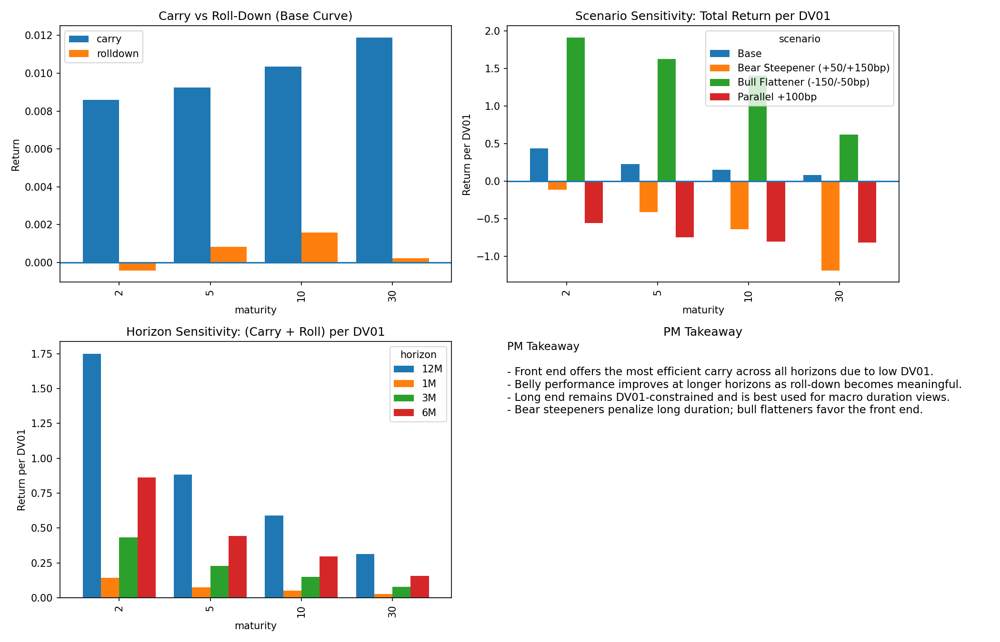

## Yield Curve Carry & Roll-Down Analyzer

A fixed-income analytics project that decomposes U.S. Treasury returns into carry, roll-down, and duration (DV01) components across different curve segments, holding horizons, and macro scenarios.

The project is designed to replicate how portfolio managers and rates analysts evaluate curve positioning decisions by focusing on risk-adjusted return drivers rather than headline yield levels.

The analysis culminates in a one-page, PM-style dashboard summarizing trade-relevant insights.

## Problem Context

In fixed-income portfolios, returns are driven not only by directional rate moves but by carry, roll-down, and duration exposure along the yield curve. Understanding where these effects are strongest — and how they change under different macro environments and holding horizons — is central to curve positioning decisions.

This project was built to systematically decompose Treasury returns into their core components and evaluate how risk-adjusted carry opportunities shift across maturities, scenarios, and time horizons.

## Key Questions Addressed

- Which maturities deliver the strongest risk-adjusted carry?
- How does carry and roll-down performance change as the holding horizon increases?
- Which curve segments perform best under different macro scenarios?
- How should a portfolio manager think about absolute returns versus DV01-normalized returns?

## Key Concepts Demonstrated

- U.S. Treasury yield curve construction
- Carry and roll-down return decomposition
- DV01-based risk normalization
- Curve segmentation (front-end, belly, long-end)
- Scenario analysis:
  - Parallel rate shifts
  - Bull flatteners
  - Bear steepeners
- Horizon sensitivity (1M, 3M, 6M, 12M)
- PM-style trade framing and interpretation
- Professional visualization and CSV-based outputs

## Analytical Framework

1. Construct the U.S. Treasury yield curve across standard maturities  
2. Decompose expected returns into carry and roll-down components  
3. Normalize returns by DV01 to assess risk-adjusted performance  
4. Apply macro scenarios to simulate curve shocks and regime changes  
5. Evaluate performance across multiple holding horizons  
6. Aggregate results into a PM-style dashboard for decision support  

## Outputs and Artifacts

This project generates multiple static outputs by design. Each CSV and chart corresponds to a specific curve segment, scenario, or holding horizon and is saved as a standalone artifact to support reproducibility, comparison across runs, and offline review.

Primary outputs include:
- Carry and roll-down tables by maturity and horizon
- DV01-normalized return comparisons
- Scenario-based performance summaries
- A consolidated portfolio-manager dashboard

Each output file corresponds to a specific analytical cut (by tenor, horizon, or scenario) and is intentionally saved as a standalone artifact. This mirrors how portfolio managers and rates analysts review fixed-income analytics through discrete tables and charts rather than a single monolithic output.

## Project Structure

The repository is organized as a fixed-income analytics pipeline rather than a packaged application.

yield-curve-carry-rolldown/
├── data/ # Yield curve inputs and processed curve data
├── analytics/ # Carry, roll-down, and DV01 calculations
├── scenarios/ # Macro scenario definitions and curve shocks
├── scripts/ # Orchestration scripts for running analyses
├── output/
│ ├── csv/ # Tabular results and summary tables
│ └── figures/ # PM dashboard and supporting charts
└── README.md # Project documentation

## Interpretation Highlights

- Risk-adjusted carry is often concentrated in specific curve segments rather than uniformly distributed  
- Longer holding horizons amplify roll-down effects relative to pure carry  
- Macro regimes materially alter which maturities offer the best return per unit of duration risk  
- DV01 normalization changes the relative attractiveness of front-end versus long-end exposure  

## Scope Note

This project is intended for analytical demonstration and portfolio use and is not a live trading or investment system.
